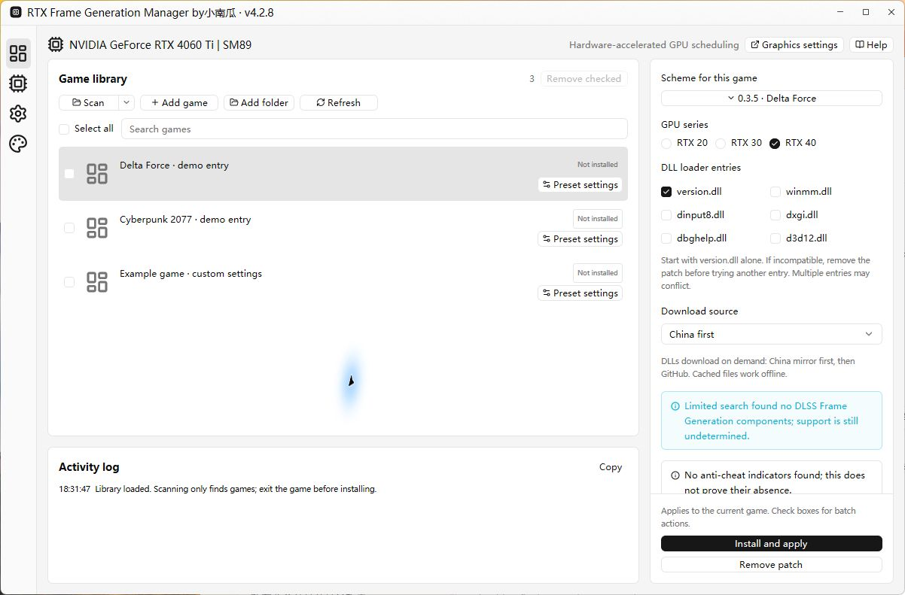

# RTX Frame Generation Manager · by 小南瓜

**An easier way to install, tune and manage frame-generation patches for RTX 20 / 30 / 40 GPUs.**

A Rust core with a native GPUI interface. One executable for your game library, cloud DLLs, per-game presets and patch removal.

**English** · [简体中文](README.zh-CN.md) · [Download 4.2.6 on GitHub](https://github.com/pandaligx/RTX-FG-Manager/releases/tag/v4.2.6) · [Gitee mirror](https://gitee.com/pandaligx/RTX-FG-Manager/releases/tag/v4.2.6)

> **New in 4.2.6:** Preview 38 offline color schemes from the sidebar, manage custom plugin folders and browse release history inside the app. Built on GPUI Kit 0.7.1 / Fast 0.1.2, with administrator startup, GPU-aware scheme selection, RTX40 MFG 1.4.1 Hotfix 1 and the new DLSSG-Transfusion 1.4.5.3 profile. [Full changelog](CHANGELOG.md)

### What's new in 4.2.6

- **Themes:** Click the palette icon in the left sidebar. All 38 light and dark color schemes appear in one searchable, scrollable list with mode badges. Hover or use the arrow keys to preview the whole interface; click or press Enter to save. Esc (even while searching) or a click outside cancels and restores the previous theme. **System** at the top preserves your independently remembered light and dark choices and switches between them automatically. All 21 GPUI Kit theme sets are built in for offline use: 36 variants plus the two defaults.
- **Native UI framework:** GPUI Kit 0.7.1 with GPUI Fast 0.1.2, retaining Windows first-frame, DPI and font compatibility adjustments. This upgrade does not establish a measured CPU or game-performance improvement.
- **Custom folders:** select a game, then **Add folder** beside Add game. Choose the required plugin folder, for example an OptiScaler plugin folder. It need not contain an EXE; it stays associated with the game for process checks, settings and removal. This does not install or configure a third-party loader.
- **Administrator startup:** Windows requests UAC permission; cancelling stops startup. This permits writes to protected game folders without changing game loading policies.
- **GPU selection:** Switching RTX20 / RTX30 / RTX40 keeps a supported scheme or selects an available one; unsupported schemes are disabled. **Project source** opens the relevant upstream page. Changing a selection does not deploy files until applied.
- **Release notes:** Settings includes offline notes for 4.2.6 and versions 4.2.0–4.2.5, selected by version inside the app. Update prompts can also display notes supplied by the server. Older manifests without notes remain usable.
- **Discovery and cleanup:** Exclude NVIDIA Vulkan diagnostic tools from game scanning and improve configuration retention, log cleanup and ownership-based removal checks.

#### RTX40 MFG · 1.4.1 Hotfix 1

The signed [upstream release](https://github.com/dashdogy/RTX40MFG-Unlock/releases/tag/v1.4.1-hotfix.1) keeps its separate `RTXMFG-Universal.json`. The manager exposes this profile for RTX40 only. Presets add VSync and a fixed-mode Reflex FPS limit. Dynamic mode uses its own target while preserving the inactive fixed limit. **The in-game Backspace menu remains upstream English**; manager controls and help support five languages.

#### DLSSG-Transfusion · 1.4.5.3

A separate integration of [SilyNoMeta/DLSSG-Transfusion](https://github.com/SilyNoMeta/DLSSG-Transfusion/releases/tag/v1.4.5.3-rtx20-30-40), with its own JSONC settings rather than RTX40 MFG JSON or other schemes' INIs. It follows the game by default, with fixed 2X–6X or Dynamic mode. 5X/6X are experimental; Dynamic defaults to a 4X ceiling and target 0 follows monitor refresh rate. Managed edits retain comments and other settings.

Select **one** of `version.dll`, `dinput8.dll`, `dxgi.dll` or `winmm.dll`. Each route uses its matching exact-export binary; the manager does not rename these alternatives interchangeably. The game must already integrate Streamline DLSS Frame Generation. Upstream RTX20 validation is emulated, and RTX20/30 Vulkan still needs physical testing. This is not universal game compatibility.

Use `Ctrl+Alt+2…6` for the multiplier, `Ctrl+Alt+G` to follow the game, `Ctrl+Alt+D` for Dynamic and `Ctrl+Alt+O` for statistics. Optional ReShade and ASI components are not bundled; Vulkan statistics need the optional compatible ReShade component. Driver-dependent Smooth Motion is a separate experimental feature and is not exposed here. Exit the game and uninstall its previous patch before switching; do not stack frame-generation schemes.

  
  
  
  
  

  

Interface example from an earlier release, using demo game entries. Version 4.2.6 adds the sidebar theme picker described above.

## What the manager handles

| Your task | Built-in support |
| --- | --- |
| Find games and deploy patches | Scans grouped by installation; manual EXE selection and custom plugin folders; individual or batch deployment with visible scheme and DLL tags |
| Get the right DLL | On-demand cloud downloads, domestic-first routing with GitHub fallback, integrity checks and reusable offline cache |
| Adjust compatibility and quality | Scheme-specific presets, separate settings for each game and scheme, and contextual **?** help |
| Update or remove a patch | Startup update checks, resumable aria2 downloads, speed and compact circular progress; ownership-based cleanup and clear retry notices |
| Use it every day | Five languages, offline light/dark color schemes with independent preferences, System appearance mode, DPI-aware layout, background tasks and a visible operation log |

**Portable EXE. No Python, Rust, CUDA Toolkit or separate aria2 installation required.** Manager releases and project-distributed DLLs are digitally signed. The Rust manager source, build instructions and verified cloud maintenance workflow are published here. Third-party components retain their respective licenses.

## What this project adds to upstream

The original frame-generation implementation comes from [dlssg_for_sm86](https://github.com/sdli1995/dlssg_for_sm86). The manager keeps both the upstream build and this project's extensions available, so you can select or revert per game.

### 0.3.5 · Delta Force extension

- **Vulkan integration:** resource interop, GPU-shared transfers, synchronization and compatible fallback paths. The bridge is merged into all six proxies; no separate bridge DLL is needed.
- **Less transfer overhead:** shared-resource and cache reuse reduce CPU image transfers, repeated allocations and waits, while retaining upstream's **310.9 model and inference optimizations**.
- **Delta Force RTX20 / CMP40HX compatibility:** eligibility adjustments for identified PCI IDs are scoped to the specified game's main module. Real CUDA architecture, VRAM, LUID and registry remain unchanged.
- **Delta Force multiplier control:** follow game, 2X, 3X or 4X in the manager. The 3X/4X path uses matching private runtime components and **does not overwrite the game's original `sl.*.dll` files**.
- **Owned per-game cleanup:** independent versioned caches, with removal of identified DLLs, INIs, logs and runtime components while preserving unknown and original game files.

### Retained 0.2.6 · DX12/Vulkan option

Based on upstream Native 0.2.4 and the **310.1 model**. It includes the Naraka typeless-texture Fix1, Vulkan interop and transfer improvements, plus deferred D3D12 loading and lifecycle fixes for the Where Winds Meet startup regression. **0.2.6 is this project's scheme version.**

Users have reported working configurations in Naraka, Delta Force, Arknights: Endfield and Where Winds Meet, including increased FPS in the RTX2070 Delta Force test. Results depend on hardware, drivers and game versions. **4X does not guarantee four times the FPS or unchanged latency.**

## Dlssg-MFG-Vulkan

An independent integration of [pipotoufikxyz-lgtm's sm86-7 release](https://github.com/pipotoufikxyz-lgtm/dlssg_for_sm86-MFG-version/releases/tag/sm86-7), with one signed `version.dll`. Upstream announces Vulkan support, including RTX Remix examples, but explicitly leaves RTX20 unconfirmed. This is not universal Vulkan compatibility, Smooth Motion, or this project's Delta Force integration.

Its separate INI protocol uses `MaxInterpolatedFrames=5` (up to 6X) and `ForceMultiplier=0` (follow game). Presets expose requested 2X–6X, dynamic MFG and target FPS, four optimizations and an on/off log switch. Dynamic MFG requires a compatible DX12 path; requests do not prove actual presentation. Upstream optimization defaults are retained and may affect image quality.

RenderScale, hotkeys and other advanced keys are preserved. Blackwell experimental toggles with upstream GPU-hang reports are not exposed. Managed edits preserve comments and unrelated INI keys; cleanup preserves unknown files. Exit the game and uninstall before switching schemes.

## RTX40 MFG

The upstream 0.3.5, Delta Force and initial RTX20/RTX30 packages also embed their matching signed backends, with one backend copy per proxy. Signing establishes publisher identity and integrity; it does not grant game or anti-cheat approval.

[RTX40MFG-Unlock v1.4.1 Hotfix 1](https://github.com/dashdogy/RTX40MFG-Unlock/releases/tag/v1.4.1-hotfix.1) is a separate RTX40 profile. It defaults to Follow game and exposes fixed 2X–6X, a Dynamic target, UI preset, VSync and a fixed-mode Reflex FPS limit. The game must already integrate Streamline DLSS FG. Vulkan is experimental and does not support Dynamic mode.

One signed universal DLL is renamed to the chosen entry; existing game/mod files are never overwritten. Settings use `RTXMFG-Universal.json`, separate from RTX20/30 INI protocols. Press **Backspace** in game for the upstream English menu. Bink entries require the original Hooked file as described upstream.

Select a game to change its scheme and DLL entries in the right sidebar. The deployment badge appears at the upper right of its row, with a compact **Presets** button below it. Scheme, entry and parameters are remembered per game. Deployment badges show actual installed schemes, DLLs and directory counts, with details on hover. Uninstall before changing scheme or entry; batch installation honors each game's own settings.

## Choose a scheme

| Scheme | API and purpose | Entry DLLs |
| --- | --- | --- |
| **0.3.5 · Github-sdli1995 — default** | Original upstream, D3D12 / SM75 and SM86, 310.9 model | Six |
| **0.3.5 · Delta Force** | This project's Vulkan and Delta Force extensions | Six |
| **Dlssg-MFG-Vulkan** | Upstream sm86-7 adds Vulkan; RTX20 unverified | version.dll |
| **RTX40 MFG · 1.4.1 Hotfix 1** | RTX40 / existing Streamline DLSS FG; separate JSON | One entry, 19 supported filenames |
| **DLSSG-Transfusion · 1.4.5.3** | RTX20/30/40 / existing Streamline DLSS FG; separate JSONC; RTX20 and older-GPU Vulkan validation remains limited | One of four matching proxies |
| **0.2.6 · DX12/Vulkan** | Retained compatibility option, 310.1 model | Five |
| **Initial · GitHub first release** | Original capabilities; files selected for RTX20 or RTX30 | version.dll |

**The original GitHub scheme remains the initial default; manual choices are remembered.** The scheme's name describes its origin, not its download route. A GitHub scheme can still be downloaded from the domestic server.

The six entries are `version.dll`, `winmm.dll`, `dinput8.dll`, `dbghelp.dll`, `dxgi.dll` and `d3d12.dll`. Start with one, preferably `version.dll`. Multiple selection is supported; the first loaded proxy leads and the others forward calls. Choose either `dxgi.dll` or `d3d12.dll`, not both. The 0.2.6 entries are version / winmm / dinput8 / winhttp / dxgi.

Upstream 0.3.5 fixes optimized-kernel selection after feature recreation, which could cause corruption or crashes. See the [upstream release notes](https://github.com/sdli1995/dlssg_for_sm86/releases/tag/0.3.5). That fix belongs to upstream and is distinct from this project's Vulkan additions.

## Delta Force: 2X / 3X / 4X

Use **Manager 4.2.1 or later** and exit the game first:

1. Add the actual `DeltaForceClient-Win64-Shipping.exe` inside `Binaries/Win64`.
2. Select **0.3.5 · Delta Force**, choose the GPU series and click **Presets** on that game's row.
3. Set the multiplier to follow game / 2X / 3X / **4X (default)**, then install/apply.
4. Start the game and enable its frame-generation switch. Exit before applying another multiplier.

The manager updates the same INI automatically. Follow game and 2X retain the original runtime; 3X and 4X use the independent cache. If original components are already loaded, their runtime is retained to avoid mixed versions. **Other games do not enter this special path.** Their generic multiplier is a ceiling and cannot add new menu options.

## Get started

1. Download `RTXManager-v4.2.6-x64.exe` and run it on Windows 10 / 11 x64. Accept the Windows administrator prompt; cancelling stops startup.
2. Use the home page's **Graphics settings** button. Under Windows Settings → System → Display → Graphics → Change default graphics settings, enable **Hardware-accelerated GPU scheduling** and restart if requested. Labels vary between Windows versions.
3. Exit the game, scan or add its actual EXE, select the GPU series, scheme and entry DLL, then install.
   Verified game executables from one installation appear as one entry. If they occupy separate directories, installation and removal cover every listed directory. Launchers and anti-cheat programs are excluded from automatic deployment; add a missed game EXE manually.
4. Enable DLSS frame generation in the game. Clicking a row selects the current game; checkboxes select batch targets.
5. Uninstall the old patch before changing patch version, scheme or entry DLL. Updating the manager does not automatically replace DLLs already installed in games.

Settings are remembered per **game + scheme**. The 0.3.5 presets include kernel mode, multiplier, UI recomposition and logging; 0.2.6 exposes multiplier, sampling and logging; Initial exposes enablement, multiplier and logging. Updating an identified deployment's presets preserves unrelated INI content and comments. The 0.2.6 Vulkan bridge does not yet follow the INI logging level; detailed 0.3.5 bridge logs do, while limited startup diagnostics remain separate.

## Cleanup, caching and updates

Both 0.3.5 schemes retain the upstream log directory and empty CacheDirectory (user cache). If an older installation crashes in Zenless Zone Zero, exit the game, select the same scheme and d3d12.dll, then install again. Only former manager paths are repaired; custom paths remain. Shared runtime caches are not removed when uninstalling one game.

- **Uninstall:** removes files identified as belonging to this project, including edited INIs, multiple proxies and recognized re-signed components. A game-running warning means the operation has not completed.
- **Pending cache cleanup:** locked caches keep a retry record and an explicit partial-completion message. Close the relevant processes and retry uninstall or **Clear cache** in Settings.
- **Preserved data:** original game files, unknown files, the game list and preferences are retained. Old test-3 restoration backups are not removed automatically. Removing a library entry is not uninstalling its patch.
- **Independent storage:** Delta Force components use `%LOCALAPPDATA%\RTXFG-Delta4X\games\<game-id>\<version>`. Manager data uses `%LOCALAPPDATA%\RTXFGManager`.
- **Cloud resources:** mirrored catalogs and DLL packages on Gitee and GitHub. Gitee is the default first source; failures show a reason before trying GitHub. aria2 handles downloads with size, speed and progress. Verified cache entries are reusable.
- **App updates:** checks run in the background on startup. Downloads are checked for size, SHA-256 and publisher signature, then replace and restart the executable using its new versioned name. The old EXE is removed after successful UI startup; failed startup restores it. Automatic downloading only prefetches a release; applying it still requires confirmation.

Patches, catalogs and app updates share one download preference. New installations default to Gitee first; an explicit GitHub preference is remembered. Existing game libraries, preferences and deployment records remain compatible with upgrades from 3.7.4.

## Compatibility notes

Frame generation depends on the game, driver, OS and GPU. Finding a game during scanning is not a compatibility verdict. Follow each game's rules, especially where anti-cheat is involved. GPU renaming changes Windows display-name fields, not hardware capability, and a game may read its device name differently.

Chinese, English, Russian, Japanese and Korean are supported, with system-language detection and remembered manual choices. See [4.2.6 release notes](https://github.com/pandaligx/RTX-FG-Manager/releases/tag/v4.2.6) for version-specific changes.

## Credits and links

[Github · sdli1995](https://github.com/sdli1995/dlssg_for_sm86) · [Community extension · pipotoufikxyz-lgtm](https://github.com/pipotoufikxyz-lgtm/dlssg_for_sm86-MFG-version) · [GPUI](https://gpui.rs/) · [GPUI Kit](https://github.com/longbridge/gpui-kit) · [GPUI Fast](https://github.com/longbridge/gpui-fast) · [aria2](https://github.com/aria2/aria2)

Thanks to [大大大怪将军阁下 on Bilibili](https://space.bilibili.com/608531525) for testing, and to users who provide compatibility feedback.

[Website](https://lgxng.cn/) · [GitHub · pandaligx](https://github.com/pandaligx) · [Bilibili](https://b23.tv/5mHCHFn) · [Third-party notices](THIRD_PARTY_NOTICES.txt)

Not affiliated with NVIDIA, game publishers or the upstream project. The manager's license does not change third-party rights. If this tool helps you, a **Star** is welcome.

Thanks also to [Bilibili · 云外逸声](https://space.bilibili.com/256887068).

## Parameters, source and maintenance

Open **Presets** on the game row. Multiplier controls appear first; other controls stay under **Advanced parameters**. Changes are marked as pending. **Apply to current game** updates only that game’s matching INI or JSON when the same scheme is installed, without downloading DLLs; **Install and apply** also supports checked batches using each game's own settings. Exit the game before applying.

The Rust manager source is published under the repository license. [BUILDING.md](BUILDING.md) documents the pinned toolchain, verified third-party tool and checks for a fresh Windows checkout. Game DLLs retain their respective upstream ownership; private DLL patches and NVIDIA SDK headers are not part of this source release.

Maintain cloud schemes in [cloud/schemes.json](cloud/schemes.json). Add immutable assets to the fixed GitHub `payloads` prerelease; automation mirrors them to the separate Gitee resource repository, preserving the manager's latest-release endpoint for older clients. It verifies downloads at both hosts, then publishes the index and finally `cloud/catalog.json`. No private-drive uploads are needed. See [cloud maintenance](docs/cloud-publishing.md). Keep old assets available for older clients.
